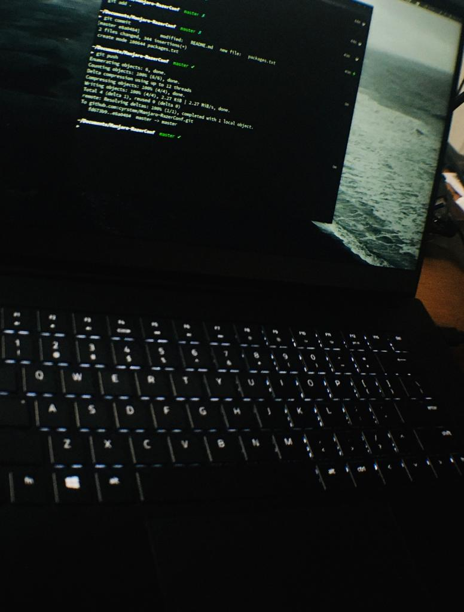

# Manjaro-RazerConf

Format: 
fix-and config file for my setup

# HeadPhones Fix
 Create  or copy file alsa.conf in: 
	'cd /etc/modprobe.d/
 then as root depmod-a ;
 	'modprobe -r snd-hda-intel;	
 	'modprobe snd-hda-intel
 reboot

# Save  packages
	'pacman -Qqe >packages.txt

# Reinstall packages 
	'sudo pacman -S --needed - <packages.txt
